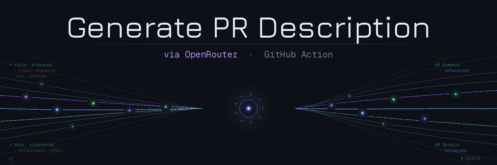

<p align="center">
  <a href="">
    
  </a>
  <h1 align="center">Generate PR Title and Description</h1>
</p>

<p align="center">
  <i>This GitHub Action uses OpenRouter to automatically generate pull request titles and descriptions. Supports multiple AI providers (OpenAI, Anthropic, Google, etc.) through a single API.</i>
</p>

## Usage

```yaml
name: Generate PR Title and Description

on:
  pull_request:
    branches:
      - main
    types:
      - opened
      - synchronize

jobs:
  pull-request:
    runs-on: ubuntu-latest
    timeout-minutes: 10
    permissions:
      pull-requests: write
      contents: read
    if: contains(fromJSON('["renovate[bot]"]'), github.event.pull_request.user.login) == false
    steps:
      - uses: actions/checkout@v6
        with:
          fetch-depth: 0
      - uses: tqer39/generate-pr-description@v2
        with:
          github-token: ${{ secrets.GITHUB_TOKEN }}
          api-key: ${{ secrets.OPENROUTER_API_KEY }}
          model: 'openai/gpt-4o-mini' # optional
          locale: 'ja' # Specify 'ja' to generate in Japanese
```

## Inputs

### `github-token`

**Required** GitHub token. Specify `${{ secrets.GITHUB_TOKEN }}`.

### `api-key`

**Required** OpenRouter API key. Specify `${{ secrets.OPENROUTER_API_KEY }}`.

### `model`

**Optional** Model identifier in OpenRouter format. Default is `openai/gpt-4o-mini`. See [OpenRouter Models](https://openrouter.ai/models) for available models.

### `max-tokens`

**Optional** Maximum completion tokens. Default is `1000`.

### `temperature`

**Optional** Sampling temperature (0.0-2.0). Default is `0.1`.

### `commit-log-history-limit`

**Optional** Limit of commit log history. Default is `70`.

### `locale`

**Optional** Language for the generated title and description. Default is `en` (English). You can specify `ja` for Japanese.

## Versioning

This project follows [Semantic Versioning](https://semver.org/). You can reference:

- **`@v2`** — Latest stable release within major version 2 (recommended)
- **`@v2.0.0`** — Specific version

Releases are created via the manual `Release` workflow (`workflow_dispatch`).

## Contribution

If you find any issues or have improvements, please create an Issue or submit a Pull Request.

## License

This action is released under the MIT license. For more information, see [LICENSE](LICENSE).
